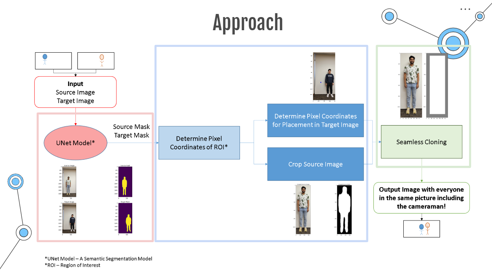
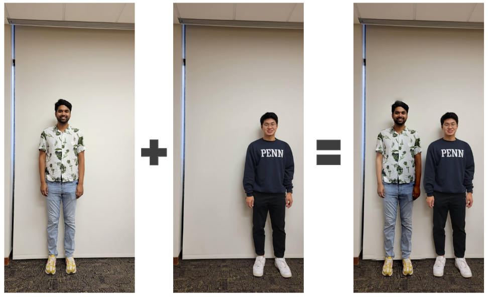

# Leaving No Photographer Behind
#### By: Sindhura Mente, Sriya Reddi, Jeffrey Li, and Amar Mohanty
In this project, we address a universal issue in taking group pictures: leaving out the photographer. Having access to a source image of only the photographer and a target image of the rest of the group, we propose a program that can incorporate both parties into one realistic final output using open-source software, namely NumPy, OpenCV, and PyTorch. The image processing pipeline involves three major steps: (1) image segmentation of person(s), (2) information extraction from the source image, and (3) gradient domain blending. From qualitative tests, our program works well on images with people standing in front of a solid background and with people standing next to each other on the horizontal axis. The final product rivals the results manually produced using Adobe Photoshop software. The program performs suboptimally on images with complex backgrounds, with people standing at different locations in the foreground, and images taken at different angles. Future work can be done to improve the robustness of our program and to combat more edge cases.

### Overall Workflow

### Final Results

### Setup
The following directions are for setting up the project on Google Colab. Note there are several sections labeled [TODO]. There will be instructions on each [TODO] section. Be sure that the directories are appropriately named according to read images from the Images folder. The same applies to saving the images into the Results folder.

1. Clone the project to your Google Drive. 
2. Define Source and Target Image: Choose your source and target images from the Images folder. Do not mix and match between folders.
3. Open main.ipynb using Google Colab.
3. Mount your google drive account to the notebook.
4. Define Source and Target Image: Choose your source and target images from the Images folder. Do not mix and match between folders.
5. Compare with Ground Truth: If you have a ground truth image (real image or Photoshopped Image), please add it here. If not, please ignore this section. There is only one Ground Truth image in our Images file, and it is Images/Solid/groundtruth.jpeg.
6. Save Output: Choose a name for your output file and save it to the Results folder.
